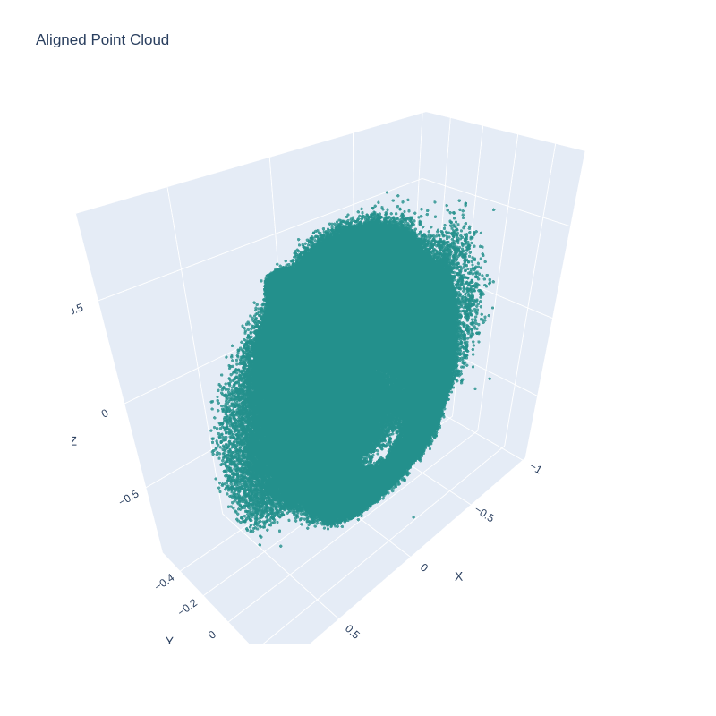
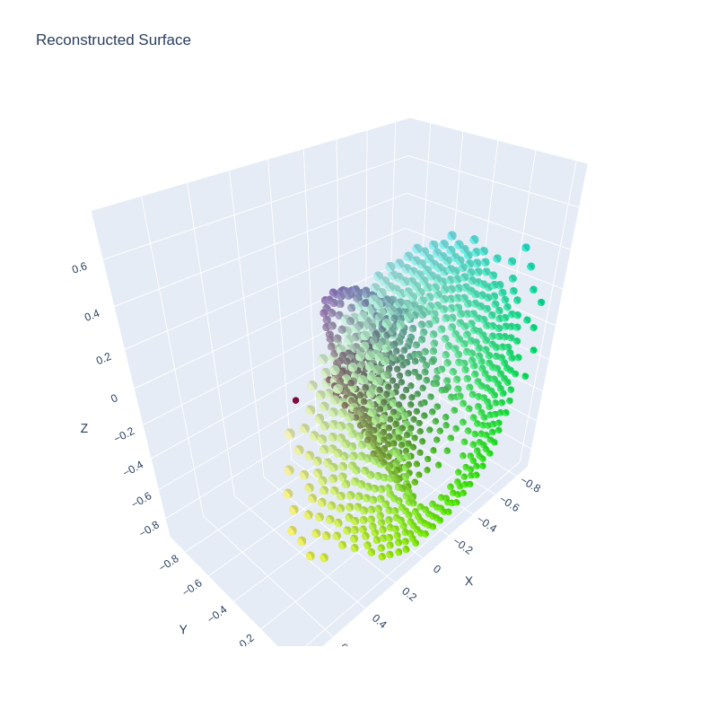

# Point Cloud Playground

A comprehensive Python package for processing and analyzing 3D point cloud data. Features advanced surface reconstruction methods including Gaussian Splatting, floor detection, and automated testing.

## 🌟 Features

### Core Processing
- **Floor Detection and Alignment**: 
  - Automatic floor plane detection using RANSAC
  - Precise alignment to YZ plane
  - Robust outlier handling

### Surface Reconstruction Methods
1. **Gaussian Splatting**
   - State-of-the-art 3D surface representation
   - Learnable 3D Gaussian parameters
   - Optimized coverage and overlap
   - Smooth surface generation
   
2. **Poisson Surface Reconstruction**
   - Watertight mesh generation
   - Configurable octree depth
   - Density-based filtering

3. **Ball-Pivoting Algorithm (BPA)**
   - Sharp feature preservation
   - Multi-scale radius support
   - Handles incomplete scans

### Visualization
- Interactive 3D visualization using Plotly
- Point cloud and mesh visualization
- Surface comparison tools
- Export to various formats (PLY, HTML)

> Some example plots from the runs: 
> - Solution aligned point cloud with Poisson Reconstruction
> 
> 
> - Solution aligned point cloud with Gaussion Splatting
> 

### Testing Framework
- Automated transformation tests
- Surface reconstruction validation
- Quality metrics computation

> Test Logs can be viewed in this file: [Logs](assets/test_logs.txt)
## Example Google Colab :)
I made a [google colab](https://colab.research.google.com/drive/1E6Fh1jOXh8IBQiFC1ZKXHdT8ap4obV5l?usp=sharing) for some example run

## 📋 Requirements

- Python 3.7+
- CUDA-capable GPU (recommended for Gaussian Splatting)

Key dependencies:
```
open3d>=0.16.0
numpy>=1.21.0
torch>=1.9.0
plotly>=5.3.0
matplotlib>=3.4.0
scikit-learn>=0.24.0
```

## 🚀 Installation


### From Source
```bash
git clone https://github.com/mr-siddy/point-cloud-processor.git
cd point-cloud-processor
pip install -e .
```

## 💻 Usage

### Command Line Interface
1. Basic processing:
```bash
./run.sh reconstruct input.ply --output-dir results --method poisson
```

2. Gaussian Splatting:
```bash
./run.sh reconstruct input.ply \
    --method gaussian \
    --num-gaussians 1000 \
    --iterations 100 \
    --learning-rate 0.01
```

3. Run tests:
```bash
./run.sh test
```

### Python API

1. Basic Usage:
```python
from point_cloud_processor import PointCloudProcessor, Visualizer

# Initialize processor
processor = PointCloudProcessor(file_path="point_cloud.ply")

# Process point cloud
aligned_pcd = processor.detect_floor()
mesh = processor.reconstruct_surface(method='poisson')

# Visualize results
visualizer = Visualizer()
visualizer.plot_mesh(mesh)
```

2. Gaussian Splatting:
```python
# Reconstruct using Gaussian Splatting
mesh = processor.reconstruct_surface(
    method='gaussian',
    num_gaussians=1000,    # Number of Gaussian primitives
    num_iterations=100,    # Optimization iterations
    learning_rate=0.01     # Learning rate
)

# Save results
visualizer.save_visualizations(
    "results",
    geometries={'mesh': mesh},
    figures={'mesh_viz': visualizer.plot_mesh(mesh)}
)
```

## 📊 Surface Reconstruction Methods

### Gaussian Splatting
Implements the method from "3D Gaussian Splatting for Real-Time Radiance Field Rendering" with modifications for surface reconstruction.

Features:
- Learnable Gaussian parameters (position, scale, rotation)
- Optimization objectives:
  - Coverage loss
  - Overlap loss
  - Smoothness regularization
- Automatic parameter initialization
- Quaternion-based rotation representation

Parameters:
```python
processor.reconstruct_surface(
    method='gaussian',
    num_gaussians=1000,     # Number of Gaussians
    learning_rate=0.01,     # Optimization learning rate
    num_iterations=100      # Number of optimization steps
)
```

### Poisson Reconstruction
Parameters:
```python
processor.reconstruct_surface(
    method='poisson',
    depth=9,          # Octree depth
    scale=1.1,        # Sampling scale
    linear_fit=False  # Use linear fit
)
```

### Ball-Pivoting Algorithm
Parameters:
```python
processor.reconstruct_surface(
    method='bpa',
    radii=[0.005, 0.01, 0.02, 0.04]  # Multiple radii
)
```

## 📁 Project Structure
```
point_cloud_processor/
├── src/
│   └── point_cloud_processor/
│       ├── core/           # Core processing
│       ├── reconstruction/ # Surface reconstruction methods
│       ├── visualization/  # Visualization tools
│       └── tests/         # Test suites
├── examples/              # Example scripts
├── scripts/              # Utility scripts
└── docs/                 # Documentation
```

## 🔧 Advanced Configuration

### Gaussian Splatting Configuration
```python
{
    'num_gaussians': 1000,     # Number of Gaussians
    'learning_rate': 0.01,     # Learning rate
    'num_iterations': 100,     # Optimization iterations
    'coverage_weight': 1.0,    # Coverage loss weight
    'overlap_weight': 0.1,     # Overlap loss weight
    'smoothness_weight': 0.01  # Smoothness loss weight
}
```

### Visualization Options
```python
visualizer.plot_mesh(
    mesh,
    opacity=0.8,
    colorscale='Viridis',
    width=800,
    height=800
)
```

## 🤝 Contributing
Contributions welcome! Please read our [Contributing Guide](CONTRIBUTING.md) for details.

## 📝 License
This project is licensed under the MIT License - see the [LICENSE](LICENSE) file for details.

## 👥 Authors
- Siddhant (Sidgraph) Saxena - *Initial work* - [mr-siddy]

## 📫 Contact
- Email: mrsiddy.py@gmail.com
- Issue Tracker: https://github.com/mr-siddy/point-cloud-processor/issues

## 📚 Citation
```bibtex
@software{point_cloud_processor,
  author = {Siddhant (Sidgraph) Saxena},
  title = {Point Cloud Playground},
  year = {2024},
  publisher = {GitHub},
  url = {https://github.com/mr-siddy/point-cloud-processor}
}
```

## 🙏 Acknowledgments
- Open3D team for the point cloud processing library
- Authors of "3D Gaussian Splatting for Real-Time Radiance Field Rendering"
- PyTorch team for the deep learning framework
- Plotly team for visualization capabilities
